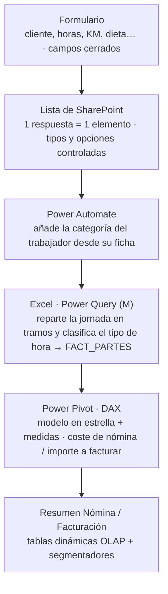

# Automatización de partes de trabajo (Formulario → SharePoint → Power Automate → Excel/Power Pivot)

Sistema para **digitalizar los partes de trabajo diarios** de una plantilla de
campo y convertirlos, sin intervención manual, en dos cifras de gestión:

- **Total a facturar** por cliente
- **Total de nómina** por trabajador

El diseño es deliberadamente simple: el destinatario final del formulario es
personal **poco habituado a la digitalización**, así que la captura de datos
tiene que ser rápida, guiada y difícil de rellenar mal. Toda la complejidad
(clasificación de horas, costes, tarifas, modelo de datos) queda escondida
detrás y se resuelve automáticamente.

### ▶ [Panel de resultados interactivo](https://jesusalonsomorales.github.io/Automatizacion-partes-de-trabajo/)

KPIs, facturación por cliente / sección / tipo de hora y coste de nómina por
trabajador, sobre los datos anonimizados del libro. *(GitHub Pages · sin Excel)*

**En una línea:** un parte de horas mal estructurado entra por un formulario y
sale como coste de nómina e importe a facturar, ya clasificado por tipo de hora
(ordinaria / nocturna / extra) y separando el coste interno del precio de venta.

**Qué se resuelve automáticamente:**

- Normalización del dato en origen (formulario + lista de SharePoint).
- Enriquecimiento con la categoría del trabajador (Power Automate).
- Reparto de la jornada en tramos y clasificación del tipo de hora (Power Query / M).
- Cálculo de coste e ingreso con un modelo dimensional en estrella (Power Pivot / DAX).
- Doble clave `Key_nomina` / `Key_variable` para que reclasificar la facturación
  no altere el histórico de nómina.

---

## Flujo de datos



### 1. Recolección: formulario

El trabajador rellena un parte por cada cliente y jornada. Los campos son
cerrados siempre que se puede (cliente, tipo de parte, trabajador), de modo
que el dato entra ya normalizado y no hay que limpiar texto libre después.

Campos capturados: tipo de parte, cliente, hora de entrada, hora de salida,
horas de desplazamiento, KM (si usa vehículo propio), nº de pernoctaciones,
descripción de los trabajos y nº de presupuesto.

### 2. Normalización: lista de SharePoint

Cada respuesta del formulario se convierte automáticamente en un elemento de
una lista de SharePoint. Al pasar por la lista conseguimos:

- **Tipos de dato consistentes** (fecha/hora reales, números, opciones).
- **Un único origen** que el resto del sistema consume.
- **Menos errores**: las opciones controladas impiden variantes de escritura
  del mismo cliente o trabajador.

### 3. Enriquecimiento: Power Automate

Un flujo se dispara al crear el elemento y **trae campos del perfil del
trabajador** —principalmente su **categoría profesional**— desde su ficha.
Así el parte no depende de que el trabajador sepa (o acierte) su categoría:
se resuelve desde el maestro de personal.

La categoría es la pieza que después conecta el parte con el coste y con la
tarifa correctos.

### 4. Cálculo: Excel + Power Query

En producción el libro está **conectado a la lista de SharePoint**
(`Datos → Actualizar todo` refresca todo el modelo). En esta copia pública
el origen se ha sustituido por una tabla local — ver
[Origen de datos: SharePoint vs. copia pública](#origen-de-datos-sharepoint-vs-copia-pública).

El código M completo está en [`power-query/`](power-query/). Lo que hace, paso
a paso:

1. **Normaliza la hora** de entrada/salida a hora local (quita zona horaria).
2. **Determina la jornada**: si la entrada es antes de las 06:00, el parte
   cuenta como del día anterior (turnos de noche).
3. **Reparte cada parte en tramos** cortando por las 22:00 y las 06:00 del día
   siguiente. Cada tramo se etiqueta como **nocturno** si empieza a las 22:00
   o más tarde, antes de las 06:00, **o cae en fin de semana**; en caso
   contrario, **diurno**.
4. **Acumula las horas** por trabajador y jornada. Las primeras **8 h** son
   ordinarias; a partir de ahí son **exceso (extra)**. Un tramo a caballo del
   límite se parte en su punto exacto.
5. **Asigna el tipo de hora final** combinando dos señales: los *criterios
   especiales* del tramo (`+1` si es nocturno, `+1` si es fin de semana) y si
   son horas de exceso (`+1`).

#### Matriz de clasificación del tipo de hora

| Situación del tramo | Horas ordinarias (≤ 8 h) | Horas de exceso (> 8 h) |
|---|---|---|
| Diurno, entre semana                 | `ORDINARIA`      | `EXTRA ORDINARIA` |
| Nocturno **o** fin de semana         | `NOCTURNA`       | `EXTRA ESPECIAL`  |
| Nocturno **y** fin de semana         | `EXTRA ESPECIAL` | `EXTRA ESPECIAL`  |

> En la práctica: cada condición que se cumple (nocturno, fin de semana,
> exceso de jornada) "sube" un escalón el tipo de hora
> `ORDINARIA → NOCTURNA / EXTRA ORDINARIA → EXTRA ESPECIAL`.

El resultado se materializa en la tabla de hechos **`FACT_PARTES`** (una fila
por tramo de parte), con las claves `Key_nomina` y `Key_variable` que se
explican más abajo.

### 5. Modelo: Power Pivot + DAX

`FACT_PARTES` se relaciona en estrella con cuatro tablas dimensión mediante
la clave `Categoría|TipoHora`:

| Tabla dimensión     | Para qué sirve                                  | Clave de unión |
|---------------------|------------------------------------------------|----------------|
| `DIM_SALARIO_BASE`  | Salario base mensual por categoría              | `Categoría`    |
| `DIM_COSTES_EXTRAS` | Importe unitario de KM, dieta, pernocta, desplazamiento | `TipoCoste` |
| `DIM_COSTE_HORAS`   | Sobrecoste variable por hora según tipo/categoría (coste interno) | `Key_nomina` |
| `DIM_TARIFAS`       | Precio de venta por hora según tipo/categoría (ingreso) | `Key_variable` |

Sobre ese modelo se definen las medidas DAX de nómina (coste horas variables,
coste KM, coste pernocta, coste dieta, coste desplazamiento, salario base,
total nómina) y de facturación (nº de horas a facturar e importe a facturar).

### 6. Salida

Dos hojas con tablas dinámicas OLAP y segmentadores/línea de tiempo:

- **`Resumen Nómina`** — coste de personal por trabajador y mes, desglosado
  en horas variables + extras (KM, pernocta, dieta, desplazamiento) + salario
  base.
- **`Resumen Facturación`** — importe a facturar por cliente, trabajador,
  parte, clase de hora y sección.

Esos mismos resultados, en versión web:
**[jesusalonsomorales.github.io/Automatizacion-partes-de-trabajo](https://jesusalonsomorales.github.io/Automatizacion-partes-de-trabajo/)**

---

## La decisión de modelado: doble clave (nómina vs. facturación)

Fue el punto de diseño más delicado. La primera versión usaba **una única
clave** (`Key`) para relacionar cada parte con su coste y su tarifa. Problema:
si después de registrar el parte se corregía la **categoría de facturación**
(revisión de presupuesto, reclasificación, corrección administrativa), esa
misma clave cambiaba **también en el histórico de nómina** y alteraba costes
ya cerrados.

Un trabajador **siempre cobra lo mismo en nómina** por su categoría real,
independientemente de con qué categoría comercial se facture el parte al
cliente. Son dos dimensiones del mismo hecho que evolucionan por separado.

La solución fue partir la clave en dos:

| Clave           | Cuándo se fija | Qué alimenta | Cambia a posteriori |
|-----------------|----------------|--------------|---------------------|
| **`Key_nomina`**   | En el momento de registrar el parte (*snapshot* de la categoría vigente del trabajador, capturada vía Power Automate). | `DIM_COSTE_HORAS` y salario base → **coste interno**. | **No.** El histórico de nómina queda protegido. |
| **`Key_variable`** | Se recalcula si cambia la categoría de facturación del parte. | `DIM_TARIFAS` → **ingreso**. | Sí, solo afecta a la tarifa. |

Resultado: reclasificar cómo se factura un parte a un cliente no distorsiona
ni un euro del histórico de coste de personal.

---

## Tablas dimensión (datos anonimizados del libro)

### `DIM_SALARIO_BASE` — salario base mensual por categoría

| Categoría   | Salario base |
|-------------|-------------:|
| CATEGORIA 1 | 1.510,25 |
| CATEGORIA 2 | 1.510,25 |
| CATEGORIA 3 | 1.745,50 |
| CATEGORIA 4 | 1.745,50 |

### `DIM_COSTES_EXTRAS` — importe unitario de conceptos extra

| Tipo de coste  | Importe unitario |
|----------------|-----------------:|
| KM             | 0,29 |
| Pernocta       | 55,00 |
| Dieta          | 44,00 |
| Desplazamiento | 11,00 |

### `DIM_COSTE_HORAS` — sobrecoste variable por hora (coste interno)

| Categoría   | ORDINARIA | NOCTURNA | EXTRA ORDINARIA | EXTRA ESPECIAL |
|-------------|----------:|---------:|----------------:|---------------:|
| CATEGORIA 1 | 0,00 | 4,80 | 12,00 | 16,80 |
| CATEGORIA 2 | 0,00 | 4,80 | 12,00 | 16,80 |
| CATEGORIA 3 | 0,00 | 4,80 | 14,40 | 19,20 |
| CATEGORIA 4 | 0,00 | 4,80 | 14,40 | 19,20 |

> La hora ordinaria ya está incluida en el salario base, por eso su sobrecoste
> variable es 0. Las demas suman sobre el salario base.

### `DIM_TARIFAS` — precio de venta por hora (ingreso)

| Categoría   | ORDINARIA | EXTRA ORDINARIA | NOCTURNA | EXTRA ESPECIAL |
|-------------|----------:|----------------:|---------:|---------------:|
| CATEGORIA 1 | 19,43 | 22,88 | 28,75 | 34,50 |
| CATEGORIA 2 | 21,73 | 25,60 | 32,15 | 38,58 |
| CATEGORIA 3 | 22,88 | 26,94 | 33,86 | 40,63 |
| CATEGORIA 4 | 25,18 | 29,66 | 37,26 | 44,71 |

---

## Ejemplo de salida — `Resumen Nómina` (2026-07)

| Trabajador | Coste horas var. | KM | Pernocta | Dieta | Despl. | Salario base | **Total nómina** |
|---|--:|--:|--:|--:|--:|--:|--:|
| Álvaro Cabrera Ruiz | 126,00 | 0 | 0 | 0 | 0 | 1.745,50 | **1.871,50** |
| Marcos Ruiz Delgado | 14,00 | 0 | 0 | 0 | 0 | 1.745,50 | **1.759,50** |
| Marta Domínguez Ríos | 361,00 | 0 | 0 | 0 | 0 | 1.510,25 | **1.871,25** |
| Sergio Navarro Peña | 97,00 | 43,50 | 220,00 | 176,00 | 22,00 | 1.510,25 | **2.068,75** |

## Ejemplo de salida — `Resumen Facturación` (por sección, total periodo)

| Sección | Nº horas a facturar | Importe a facturar |
|---|--:|--:|
| Cafetería | 23 | 521,94 |
| Mantenimiento | 14 | 344,68 |
| Informática | 12 | 338,58 |
| Cofre | 11 | 270,50 |
| … | … | … |
| **Total general** | **150** | **3.580,72** |

---

## Origen de datos: SharePoint vs. copia pública

En producción, la consulta `FACT_PARTES` arranca con:

```m
Origen = SharePoint.Tables("https://<tenant>.sharepoint.com/sites/partes", [ApiVersion = 15]),
```

Eso hace que **quien abra el libro sin acceso a ese SharePoint reciba un error
al actualizar** y no pueda ver ni los datos ni el resto de la lógica. Para esta
copia pública el acoplamiento se ha roto así:

1. Se ha añadido al libro una hoja **`ORIGEN_PARTES`** con una tabla del mismo
   nombre: un *snapshot* anonimizado de los campos que devolvía la lista de
   SharePoint (un registro por parte). El CSV de partida está en
   [`data/ORIGEN_PARTES.csv`](data/ORIGEN_PARTES.csv).
2. El primer paso de la consulta se ha reescrito para leer de esa tabla:

   ```m
   Origen = Excel.CurrentWorkbook(){[Name="ORIGEN_PARTES"]}[Content],
   ```

   Como `ORIGEN_PARTES` ya no viene de SharePoint, se omiten los pasos que
   expandían el registro `Author` (los campos `Author.FirstName`,
   `Author.LastName`, `Author.GUID` y `Categoría` ya son columnas de la tabla)
   y `ID.1` se deriva de `Id`.

3. **El resto de la consulta es idéntico**: el reparto en tramos, la
   clasificación del tipo de hora, la acumulación de horas y la doble clave
   siguen siendo visibles y ejecutables. El M completo (ya adaptado) está en
   [`power-query/FACT_PARTES.m`](power-query/FACT_PARTES.m).

Resultado: cualquiera puede descargar el `.xlsx`, pulsar `Datos → Actualizar
todo` y regenerar el modelo completo **sin credenciales ni acceso al
SharePoint de la empresa**.

### Reproducir el desacoplamiento en tu copia

Si partes del libro original conectado a SharePoint:

1. Importa [`data/ORIGEN_PARTES.csv`](data/ORIGEN_PARTES.csv) con
   `Datos → Desde texto/CSV` (así `Hora entrada` / `Hora salida` se detectan
   como fecha-hora) y cárgalo como tabla; ponle de nombre **`ORIGEN_PARTES`**
   (pestaña *Diseño de tabla → Nombre de la tabla*). Si lo pegas a mano,
   formatea esas dos columnas como fecha-hora antes de seguir.
   > La tabla de Excel no admite dos encabezados que solo difieran en
   > mayúsculas, así que el CSV **no** incluye la columna `ID` original de
   > SharePoint (idéntica a `Id`); la consulta la reconstruye como `ID.1`.
2. `Datos → Consultas y conexiones` → `FACT_PARTES` → `Editar` → `Editor
   avanzado`. Reemplaza **todo** el cuerpo por el de
   [`power-query/FACT_PARTES.m`](power-query/FACT_PARTES.m), pegando solo
   desde `let` hasta `#"Columnas reordenadas1"` (sin el `shared FACT_PARTES =`
   ni el `;` final).
3. `Cerrar y cargar` → `Datos → Actualizar todo`.
4. Guarda. Comprueba que ya no queda ninguna URL de SharePoint:
   descomprime el `.xlsx` (es un ZIP) y busca `sharepoint.com` en
   `customXml/` — no debe aparecer en `item*.xml` (la parte `DataMashup`).

> ⚠️ La ruta real de SharePoint **también viaja dentro de la parte
> `DataMashup`** del `.xlsx`, no solo en el panel de conexiones. Revisar solo
> `Datos → Consultas y conexiones` no basta: hay que reescribir el paso
> `Origen` de cada consulta y volver a guardar para que desaparezca del
> binario.

## Anonimización

Esta copia del libro está anonimizada:

- Nombres reales de trabajadores → nombres ficticios.
- Cliente real → cliente ficticio (`Construred` + ciudad).
- Salarios base, dietas/KM/pernocta, coste por hora y tarifas → recalculados
  a cifras distintas de las reales, manteniendo las proporciones entre
  categorías.
- Origen SharePoint → tabla local `ORIGEN_PARTES` (ver sección anterior).

**Limitación conocida:** el modelo de Power Pivot (`xl/model/item.data`, la
parte binaria que alimenta las tablas dinámicas OLAP) es un *snapshot*
cacheado de la última actualización y no se puede editar con seguridad fuera
de Excel. Si al abrir vieras cifras que no cuadran con las tablas ya
anonimizadas, haz `Datos → Actualizar todo`.

---

## Cómo abrirlo

1. Descarga `data/Resumen_partes_de_trabajo_anonimizado.xlsx` y ábrelo en
   **Excel de escritorio** (el modelo de datos y las tablas dinámicas OLAP no
   se renderizan en Excel Online ni en Google Sheets).
2. `Datos → Actualizar todo` para regenerar el modelo desde `ORIGEN_PARTES` y
   las tablas dimensión (todo local, sin SharePoint).
3. Explora `Resumen Nómina` y `Resumen Facturación`.

### Estructura del repositorio

| Ruta | Contenido |
|---|---|
| `data/Resumen_partes_de_trabajo_anonimizado.xlsx` | Libro completo: Power Query + Power Pivot + tablas dinámicas OLAP |
| `data/ORIGEN_PARTES.csv` | Snapshot anonimizado que alimenta las consultas (sustituye a SharePoint) |
| `power-query/FACT_PARTES.m` | Consulta M de la tabla de hechos, adaptada a origen local |
| `docs/` | Panel web (`index.html` + `data.json`) publicado con GitHub Pages |
| `.gitignore` | Ignora archivos de bloqueo/temporales de Office |

### Hojas del libro

| Hoja | Contenido |
|---|---|
| `ORIGEN_PARTES` | Tabla local con el snapshot de partes (origen de las consultas) |
| `FACT_PARTES` | Tabla de hechos: una fila por tramo de parte |
| `DIM_SALARIO_BASE`, `DIM_COSTES_EXTRAS`, `DIM_COSTE_HORAS`, `DIM_TARIFAS` | Tablas dimensión |
| `Resumen Nómina` | Tabla dinámica OLAP + KPIs de coste de personal |
| `Resumen Facturación` | Tabla dinámica OLAP + KPIs de ingreso por cliente |

---

## Qué demuestra este proyecto

| Competencia | Dónde se ve |
|---|---|
| **Gobierno del dato en origen** | Formulario de campos cerrados + lista de SharePoint: el dato entra normalizado, sin limpieza posterior. |
| **Automatización de flujos** | Power Automate enriquece cada parte con datos de ficha del trabajador sin intervención manual. |
| **Transformación con Power Query (M)** | Reparto de la jornada en tramos horarios, acumulación de horas y clasificación del tipo de hora — lógica no trivial, resuelta en el lenguaje M ([`power-query/FACT_PARTES.m`](power-query/FACT_PARTES.m)). |
| **Modelado dimensional** | Esquema en estrella `FACT_PARTES` + 4 dimensiones, con relaciones y medidas DAX en Power Pivot. |
| **Criterio de negocio** | La separación `Key_nomina` / `Key_variable` protege el histórico de coste de personal frente a reclasificaciones de facturación: una decisión de diseño, no de herramienta. |
| **Reproducibilidad** | El libro se ha desacoplado de su origen corporativo para que cualquiera pueda abrirlo y actualizarlo sin credenciales. |

## Stack

`Microsoft Forms` · `SharePoint` (lista, origen de datos) · `Power Automate`
(enriquecimiento) · `Excel` · `Power Query (M)` · `Power Pivot` · `DAX`

---

Proyecto desarrollado por [Jesús Alonso Morales](https://github.com/JesusAlonsoMorales) —
control financiero en transición hacia Data Analytics.
